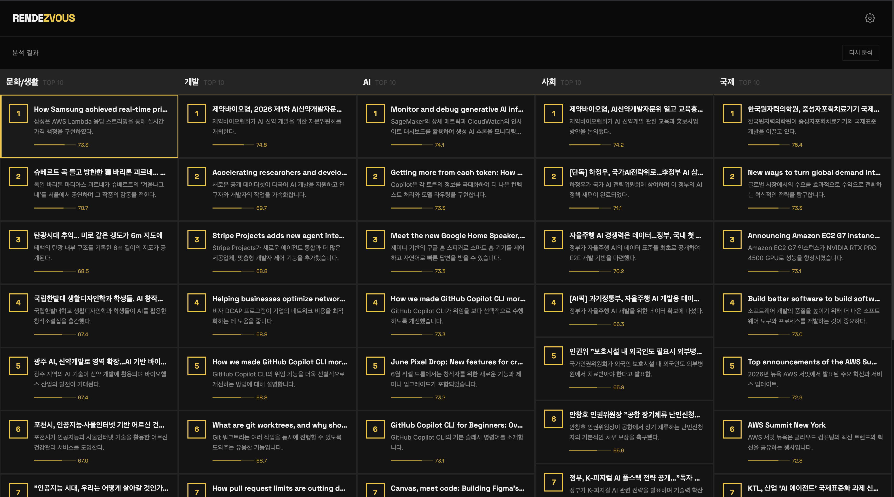
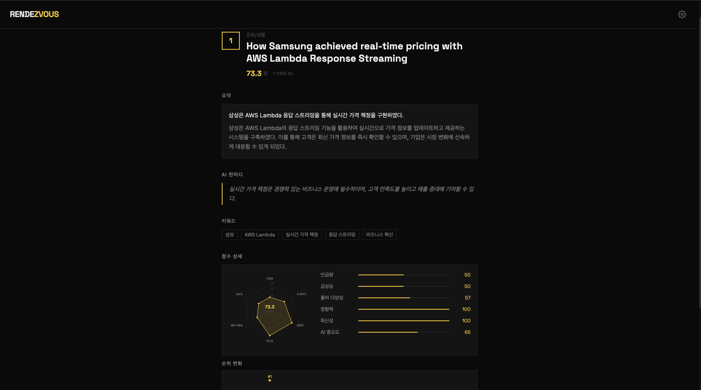

<div id="top"></div>

<!-- PROJECT LOGO -->
<br />
<div align="center">
    

  <h3 align="center">Rendezvous (1.0.0)</h3>

  <p align="center">
    클릭 한번으로 만나는 오늘의 소식
  </p>

</div>
<br />

뉴스·RSS·YouTube·Reddit 데이터를 수집해 토픽별 트렌드를 자동으로 분석하고 정리해주는 백엔드 프로젝트입니다.
임베딩 기반 군집화로 트렌드를 구조화하고, LLM은 마지막 요약 단계에서만 사용해 비용과 일관성을 동시에 챙기는 것을 목표로 만들었습니다.

<br>

## 프로젝트 소개

매일 쏟아지는 뉴스와 커뮤니티 글 중에서 지금 무엇이 화제인지 직접 찾아보는 건 생각보다 시간이 많이 듭니다.
Rendezvous는 관심 있는 토픽(AI, 개발, 사회, 국제 등)을 설정해두면, 여러 출처에서 데이터를 모으고 비슷한 내용끼리 묶어서 "지금 뜨는 이야기"를 순위와 함께 보여줍니다.

- 토픽을 고르면 RSS / 뉴스 / 유튜브 / Reddit / 공식 블로그에서 관련 문서를 수집합니다.
- 임베딩 유사도로 비슷한 소식을 하나의 트렌드로 묶습니다.
- 언급량, 출처 다양성, 신뢰도, 최신성, 모멘텀 등을 종합해 점수를 매기고 순위를 정합니다.
- 마지막에만 LLM을 호출해 한국어 요약과 코멘트를 생성합니다.
- 트렌드별 순위 변화를 날짜별로 누적 저장해 히스토리를 볼 수 있습니다.

<br>

## 화면

<!-- 메인 화면 스크린샷 -->



<!-- 상세 화면 스크린샷 -->



<br>

## 기술 스택

| 구분          | 기술                            |
| ------------- | ------------------------------- |
| 웹 프레임워크 | FastAPI                         |
| 언어          | Python 3.14                     |
| 데이터베이스  | Supabase (PostgreSQL)           |
| 임베딩        | OpenAI `text-embedding-3-small` |
| LLM 요약      | OpenAI `gpt-4o-mini`            |
| 데이터 수집   | RSS (feedparser), httpx         |
| 비동기 처리   | asyncio, BackgroundTasks        |
| 환경설정      | pydantic-settings               |
| 서버 실행     | uvicorn                         |

<br>

## 아키텍처

```
요청 (POST /api/trends/analyze)
        │
        ▼
  분석 Job 생성 ── topic별 분석 작업 등록
        │
        ▼  (topic마다 반복, 백그라운드 실행)
┌────────────────────────────────────────┐
│ 1. 데이터 수집      RSS / 뉴스 / 유튜브 / Reddit / 공식 블로그 병렬 수집 │
│ 2. 전처리           중복 제거, 키워드 필터링                          │
│ 3. 임베딩 & 군집화   코사인 유사도 임계값(0.82) 기반 클러스터링         │
│ 4. 점수 계산        언급량·다양성·영향력·최신성·모멘텀 등 가중합        │
│ 5. LLM 요약         한국어 제목/요약/코멘트 생성                      │
│ 6. 대표 링크 선정    신뢰도 + 임베딩 + 텍스트 유사도 기반 랭킹          │
│ 7. 결과 저장        Supabase에 트렌드 / 점수 / 링크 / 일별 히스토리 저장 │
└────────────────────────────────────────┘
        │
        ▼
  결과 조회 (GET /api/trends/...)
```

트렌드 군집화는 KMeans처럼 군집 수를 미리 정하지 않고, 코사인 유사도가 임계값 이상이면 같은 트렌드로 묶고 아니면 새 트렌드를 만드는 방식으로 구현했습니다. 그날그날 화제의 개수가 들쭉날쭉한 뉴스 데이터 특성에 더 잘 맞는다고 판단했습니다.

<br>

## 점수 계산

트렌드의 최종 점수는 7가지 지표를 가중합해서 계산합니다.

| 지표                      | 가중치 | 설명                                         |
| ------------------------- | ------ | -------------------------------------------- |
| 언급 빈도 (mention)       | 18%    | 같은 트렌드로 묶인 문서 수                   |
| 임베딩 유사도 (embedding) | 18%    | 트렌드 중심과 문서들의 평균 유사도           |
| 모멘텀 (momentum)         | 16%    | 시간대별 언급 증가 추세 — "급상승" 판단 기준 |
| 출처 다양성 (diversity)   | 12%    | 서로 다른 소스 종류 개수                     |
| 영향력 (influence)        | 12%    | 출처 신뢰도 (공식 블로그 > 뉴스 > RSS 순)    |
| 최신성 (recency)          | 12%    | 가장 최근 문서의 발행 시점                   |
| AI 중요도 (ai_importance) | 12%    | AI/기술 관련 키워드 포함 여부                |

`trend_momentum_score`가 일정 기준 이상이면 "급상승" 트렌드로 별도 표시됩니다.

<br>

## 주요 API

| Method | Endpoint                           | 설명                                              |
| ------ | ---------------------------------- | ------------------------------------------------- |
| `POST` | `/api/trends/analyze`              | 토픽 분석 작업 시작 (비동기)                      |
| `GET`  | `/api/trends/jobs/{job_id}`        | 분석 작업 진행 상태 조회                          |
| `GET`  | `/api/trends/jobs/{job_id}/result` | 분석 작업 결과 조회                               |
| `GET`  | `/api/trends/latest`               | 가장 최근 완료된 분석 결과 조회                   |
| `GET`  | `/api/trends/{trend_id}`           | 트렌드 상세 조회 (점수, 링크, 순위 히스토리 포함) |
| `GET`  | `/api/settings`                    | 유저 설정 조회                                    |
| `PUT`  | `/api/settings`                    | 유저 설정 저장 (토픽, 기간, 소스 선택 등)         |
| `GET`  | `/api/health`                      | 헬스체크                                          |

<br>

## 데이터베이스 구조

| 테이블                | 역할                              |
| --------------------- | --------------------------------- |
| `user_settings`       | 유저별 토픽/기간/소스 설정        |
| `analysis_jobs`       | 분석 작업 단위 상태 관리          |
| `analysis_topics`     | 작업 내 토픽별 진행 상태          |
| `trends`              | 트렌드 결과 (제목, 순위, 요약 등) |
| `trend_scores`        | 트렌드별 점수 상세                |
| `trend_links`         | 트렌드별 원본 뉴스 링크           |
| `trend_daily_scores`  | 날짜별 점수/순위 히스토리         |
| `collected_documents` | 수집된 원본 문서                  |

<br>
